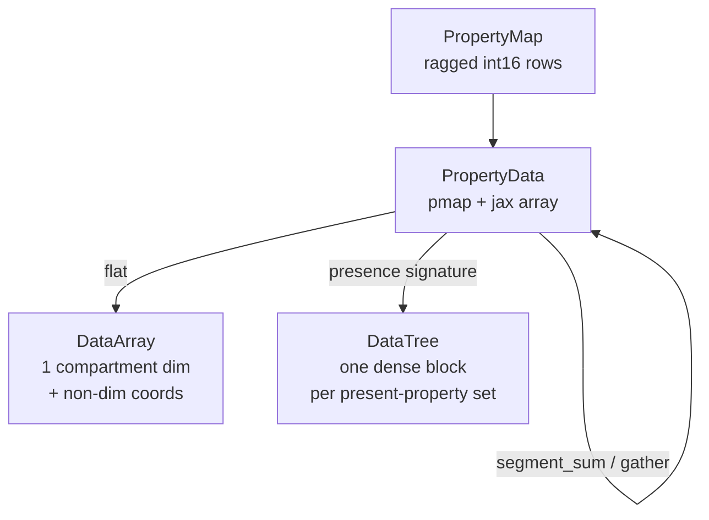

## Goal

Answer four questions with measurements, not opinion, and write the answers down:

1. What does a `PropertyData` pytree cost per `jax.jit` dispatch, and which `PropertyMap` hashing strategy wins?
2. What is the minimum useful algebra over ragged compartment data (select, scoped update, reduce along a property, broadcast along a property)?
3. Is xarray worth a dependency here, and via which of the three routes?
4. Does a lazy layer buy anything that XLA fusion does not already give us?

No changes to `src/summer4` on this branch. That keeps `pixi run check-branch` trivially green (`scripts/check_feature_branch.py:71` returns early when no `src/summer4/*.py` changed) and avoids freezing a public API before the evidence exists.

## Branch and layout

```bash
git fetch origin && git switch -c explore-datatypes origin/main
```

`AGENTS.md` prescribes `feat/|fix/|docs/|chore/` prefixes; using the literal `explore-datatypes` you asked for, noted as a deliberate one-off.

```
explorations/datatypes/
  prototype.py       PropertyData + ops, NOT part of the package
  xr_bridge.py       PropertyData <-> xarray, incl. a vendored pytree registration
  FINDINGS.md        the deliverable
  01-propertydata.ipynb
  02-xarray-comparison.ipynb
plans/explore-datatypes.plan.md    this plan, per AGENTS.md
```

Notebooks live outside `examples/notebooks/` so `pixi run test` does not start depending on xarray or a git-installed package. A separate `pixi run explore-test` task executes them so they are still verified.

## The central tension to test

`PropertyMap` is ragged: a flat row list with `-1` for absent (`src/summer4/propertymap.py:59-73`). xarray's real value (named dims, automatic broadcasting, `.sel()`) assumes a dense hypercube. Two encodings, and the spike measures both:

- **Flat**: one `compartment` dim plus a non-dimension coordinate per property. Handles ragged maps, but `.sel()` does not work on non-dim coords and no cross-property broadcasting happens. xarray contributes labels and ecosystem, not algebra.
- **Presence-signature blocks**: a ragged map partitions exactly into dense hypercubes keyed by which properties are present. Each block is a genuine N-D `DataArray`; the whole map is a `DataTree`. This is the encoding where xarray actually earns its keep, and it is the most interesting thing here.



## Prototype scope (`explorations/datatypes/prototype.py`)

```python
@dataclass(frozen=True)
class PropertyData:
    pmap: PropertyMap        # static aux; compartment axis is the LAST axis
    data: jax.Array          # shape (..., pmap.size)
```

Operations, all deriving their indices from the static `pmap` so they are compile-time constants:

- elementwise arithmetic with another `PropertyData` (same pmap) or a scalar
- `d[sel]` gather, `d.at[sel].set/add/mul(...)`, `d.where(sel, other)` — indices from `pmap.select(sel)`, already memoised by the existing `_cache`
- `d.sum_over(prop)` — `jax.ops.segment_sum` with static segment ids, returning data over a derived pmap
- `d.broadcast_over(prop)` — `values[codes[:, col]]`, a static gather
- `d.normalise_within(prop)` — the composition, which is the realistic modelling call

Two pytree registrations to compare head to head:

- **A**: `PropertyMap.__hash__` from a cached digest of `codes.tobytes()` plus properties and history. Structurally equal maps share a treedef, so no spurious recompiles, but every dispatch pays an `__eq__` that currently does a full `np.array_equal` (`src/summer4/propertymap.py:326-339`).
- **B**: an identity-hashed `StaticPMap` wrapper. Dispatch is O(1), but two structurally identical maps retrace.

Gotcha to cover with a test: `tree_map` calls unflatten with tracers and sentinel objects, so `__init__` must not eagerly validate `data.shape`.

## Benchmarks (notebook 01)

At roughly 1k and 100k compartments, using `%timeit`-equivalent plain-Python timing since notebooks must be magic-free:

- jit dispatch overhead: raw `jnp` array vs `PropertyData` variant A vs variant B
- `.at[sel].add(x)` vs hand-written `jnp` indexing
- `sum_over` via `segment_sum` vs a one-hot matmul
- chained elementwise ops, eager vs hand-fused, inside `jit` — the evidence for or against a lazy layer

## xarray comparison (notebook 02)

Add a pixi feature `explore` with `xarray` (2026.x) and jax 0.6.x, and evaluate three routes:

- **PyPI `xarray-jax` 0.0.5** — expected to be ruled out immediately: pins `jax<0.5.0`, `xarray<2025.0.0`, incompatible with the 0.6.2 default env. Confirm and record.
- **`gdm-xarray-jax`** from a pinned GitHub commit — not on PyPI, needs `xarray>=2026.1.0`.
- **Vendored registration** in `xr_bridge.py` — since jax 0.6.2 arrays expose `__array_namespace__`, xarray holds them natively and we only need `register_pytree_node` for `Variable`/`DataArray`/`Dataset`.

Then measure both encodings: flat round-trip `PropertyData -> DataArray -> PropertyData` (is it free under trace?), and presence-signature blocks (does dense N-D broadcasting beat our flat gather plus `segment_sum`?). Also record which selector forms survive translation to xarray indexers, especially Kleene *unknown* — `sev.absent()` has no natural xarray equivalent on a flat non-dim coordinate.

## Lazy operations

Working hypothesis to falsify, not build: inside `jit`, XLA already fuses elementwise chains, so a Python-level lazy graph adds API surface for no runtime gain. The plausible wins are static-side only — memoising derived segment ids and one-hot matrices, and coalescing consecutive `.at[sel]` scatters into one. Notebook 01's fusion benchmark decides it; the default outcome is a documented "no".

## Deliverable

`explorations/datatypes/FINDINGS.md` recommending one representation, one xarray route, one hashing strategy, and a verdict on laziness — plus the concrete list of `src/summer4` changes the follow-up feature branch needs (starting with making `PropertyMap` hashable).

## Verification

```bash
pixi run lint            # ruff covers explorations/ once added to the paths
pixi run test            # must stay green and untouched
pixi run explore-test    # new: executes the two spike notebooks
pixi run check-branch    # passes: no src/summer4 changes
```
