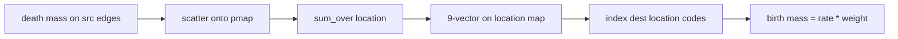

# Schema refs and location births

Follow-up on the [explore-flows](plans/explore-flows.plan.md) spike only: [`explorations/flows/prototype.py`](explorations/flows/prototype.py), [`explorations/flows/01-flows.ipynb`](explorations/flows/01-flows.ipynb), [`tests/test_explore_flows.py`](tests/test_explore_flows.py), [`explorations/flows/FINDINGS.md`](explorations/flows/FINDINGS.md). Copy this plan to `plans/explore-flows-refs.plan.md` on the existing `explore-flows` branch. Do not edit the original explore-flows plan. Do not touch `src/summer4`.

## 1. `derived_refs(schema)` instead of `DerivedParamStructProxy`

Add a factory that takes a `typing.NamedTuple` class and returns an instance whose fields are `FieldRef((name,))`:

```python
class Derived(NamedTuple):
    foi: float
    death_rate: float

D = derived_refs(Derived)   # D.foi is FieldRef(("foi",)); IDE completes schema fields
```

- Annotate the return as the schema type (`TypeVar` bound to `NamedTuple`) so tab-complete is the real `_fields`. Runtime values are `FieldRef`s (the documented type lie).
- Reject non-NamedTuple schemas.
- `compute_derived_params` returns the same `NamedTuple` with floats; `_lookup_path` already works via `getattr`.
- Remove `_DerivedProxy` / `DerivedParamStructProxy` from [`prototype.py`](explorations/flows/prototype.py) and [`explorations/flows/__init__.py`](explorations/flows/__init__.py).
- Leave `FieldRef.__getattr__` as-is (nested paths). Flat schemas do not need it.

## 2. `add_flow` returns `FlowRef`; drop `Flows`

```python
death = model.add_flow(ExitFlow("death", Everything(), D.death_rate))
model.add_flow(EntryFlow("birth", age["0-4"] & state["S"], death.sum_over(location)))
```

- [`FlowModel.add_flow`](explorations/flows/prototype.py) returns `FlowRef(flow.name)` after the uniqueness check.
- Remove `_FlowProxy` / `Flows`. Keep `FlowRef(name)` constructible for forward refs (cycle test: `FlowRef("b").sum()` before `b` is added).

## 3. `FlowRef.sum_over(prop)`

Extend `FlowRef` so `.sum()` stays a scalar and `.sum_over(location)` reduces contribution onto that property’s traits (the “CategoryData”: a reduced last-axis array, not a new type).



Eval (NumPy-native so JAX is not required for unit tests):

1. Scatter producer `mass` onto the full map (`src_idx` for exit/transition, `dest_idx` for entry).
2. Segment-sum by the property’s code column (skip `_NA`).
3. Return a small internal `_SubmapRate(data, properties)` — do not call JAX `PropertyData.sum_over` from the NumPy backend.
4. Extend [`_align_rate`](explorations/flows/prototype.py): if the rate lives on a submap, index `gather_idx` (entry dests) by those property codes. Several dests that share a location get the same rate; existing dest `weight` / `1/N` still splits **inside** that location.

`.sum()` remains `xp.sum(values)`. One `Property | str` is enough; multi-axis `sum_over` can wait.

## 4. Notebook story

In [`01-flows.ipynb`](explorations/flows/01-flows.ipynb):

- Declare `Derived` + `D = derived_refs(Derived)` next to the infection flow; use `D.foi` / `D.death_rate`.
- Section 6: `death = model.add_flow(...)`; birth rate is `death.sum_over(location)`. Dest is still `age["0-4"] & state["S"]` (one cell per location), so dest weights stay `1.0`, not `1/9`.
- Section 7: `compute_derived_params` returns `Derived(...)`. Keep `sum(dy) == 0`. Add a per-location assert: births into each young-S cell equal `death_rate * y[location].sum()` (seed uneven location populations if needed so this is visibly not a global `1/9` split).
- Drop `SimpleNamespace` / `DerivedParamStructProxy` / `Flows` imports.

## 5. Tests and FINDINGS

Update [`tests/test_explore_flows.py`](tests/test_explore_flows.py):

- `derived_refs` exposes only schema fields; unknown attribute raises.
- `add_flow` return value equals `FlowRef(name)`.
- Location `sum_over`: two locations, uneven `y`, birth dests receive that location’s death total (not a global sum).
- Cycle test uses `FlowRef("b")`.
- Existing notebook-exec test stays the smoke test.

Rewrite the rate-proxy bullets in [`FINDINGS.md`](explorations/flows/FINDINGS.md): schema `derived_refs`, `add_flow` → `FlowRef`, `sum_over` as the reduced-map rate, singleton proxies retired. Note that a public API should still validate `FieldRef` paths at compile time against the NamedTuple.

## Out of scope

- Time-varying `split=`
- A separate `CategoryData` type
- Promoting anything into `src/summer4` / `examples/notebooks/`
- `compile(..., derived_type=)` path validation (FINDINGS only)
