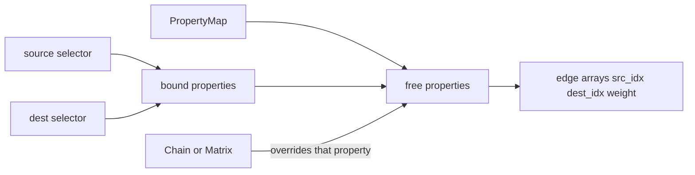

# Draft Flows (`explore-flows`)

## Intent and landing

This is a **design spike**, same shape as [`explore-datatypes`](plans/explore-datatypes.plan.md): prove the join, rate, and vector-field story before freezing a public API.

- Branch `explore-flows` from latest `main` (deliberate exception to the `feat/` prefix).
- **No `src/summer4` changes.** Taxonomy stays NumPy-only. `check-branch` stays trivially green.
- Copy this plan to [`plans/explore-flows.plan.md`](plans/explore-flows.plan.md).
- Work lives under `explorations/flows/`. Notebooks stay out of `examples/notebooks/` so `pixi run test` does not grow a JAX/flows dependency.

`pythonpath` already includes `.` ([`pyproject.toml`](pyproject.toml)), so `from explorations.flows.prototype import ...` works in tests.

```
explorations/flows/
  prototype.py       Flow types, join, rate exprs, vector-field compile
  propertydata.py    Slim PropertyData copy from explore-datatypes (digest pytree)
  FINDINGS.md        what to promote later
  01-flows.ipynb     SIR × age + ageing + migration + derived death + replacement births
tests/test_explore_flows.py   join / conservation / rate-ref / vector-field unit tests
```

Copy a **slim** PropertyData (wrap/check, last-axis compartments, gather/scatter/`at`, no xarray) from `explore-datatypes` (`explorations/datatypes/prototype.py` on that local branch). Do not merge that branch; do not take the xarray spike.

## What a Flow is

One **named** object, not one object per edge (summer3, not summer2). Against a `PropertyMap` it actualizes to index arrays plus a rate expression.

```python
TransitionFlow("infection", source=state["S"], dest=state["I"], rate=Derived.foi)
ExitFlow("death", source=Everything(), rate=Derived.computed_death_rate)
EntryFlow("birth", dest=age["0-4"] & state["S"], rate=Flows.death.sum())
```

Optional `split` on `TransitionFlow` / `EntryFlow` sets dest fan-out weights (default `1/N`). See pairing section.

| Kind             | Default law                                          | Indices               |
| ---------------- | ---------------------------------------------------- | --------------------- |
| `TransitionFlow` | `rate * y[src]` onto dest (optional `absolute=True`) | `(src, dest, weight)` |
| `ExitFlow`       | `rate * y[src]` (optional `absolute=True`)           | `(src, weight)`       |
| `EntryFlow`      | absolute `rate`                                      | `(dest, weight)`      |

No `InfectionFrequencyFlow` / `AgeStratification` / `CrudeBirthFlow`. Infection FOI and replacement births are **derived values** (or other flows), not subclasses.

Constructor order follows your sketch and summer3: `(name, selector(s), rate)`.

## Pairing modes (the join)

`select` / `partition` / `group_by` on [`PropertyMap`](src/summer4/propertymap.py) are the only inputs, as the taxonomy plan required.

**Bound properties** = names mentioned in either selector tree (`Trait` / `IsIn` / `Present` / `Absent`). **Free properties** = remaining properties that are present on both selected sets. Pair `s` with `d` iff they agree on every free property.



Three ways to specify edges:

1. **Identity (simple S→I).** `TransitionFlow("inf", state["S"], state["I"], rate)`. `state` is bound; `age` / `location` stay free. One flow, `N_AGES` (× leftover) edges.
2. **Chain (ageing).** Either several identity flows, or one flow with an explicit trait list so the top band has no outgoing edge:

```python
TransitionFlow(
    "ageing",
    source=age.present(),
    dest=age.present(),
    pairing=TraitChain(age, (("0-4", "5-9"), ("5-9", "10+"))),
    rate=Derived.ageing_rate,  # scalar or per-band PropertyData
)
```

`TraitChain` removes `age` from the free set and emits one identity-join per pair. Leftover properties (state, location) still match.

3. **Matrix (migration).** Sparse or dense over one property’s traits; leftover properties still match:

```python
TransitionFlow(
    "migration",
    source=location.present(),
    dest=location.present(),
    pairing=TraitMatrix(location, mig),  # (n_traits, n_traits), dest × source
    rate=1.0,  # matrix entries are the per-edge rates if rate is 1
)
```

Only nonzero entries become edges. A `rate` other than `1` multiplies those entries.

**Ragged dest (severity only on I):** identity-join on leftovers, then **split source mass** across dests that share a free-key. Weights live on the edge array so conservation is `sum(dest) == source` for a unit transition. Unmatched free-keys raise.

Default weights are **equal `1/N`** over the dests in that free-key group (summer3 `reconcile_broadcast` / summer2’s default `population_split`). Different ratios are **a property of the flow**, not of a `Stratification`. In summer2 this lived on the strat as `set_population_split({"mild": 0.8, "severe": 0.2})` and then applied to every dest-only fan-out of that strat (and to initial population). Here only the flow’s dest fan-out is in scope:

```python
TransitionFlow(
    "infection",
    source=state["S"],
    dest=state["I"],
    rate=Derived.foi,
    split={severity: {"mild": 0.8, "severe": 0.2}},
)
EntryFlow(
    "import",
    dest=state["S"],  # S is age-stratified → dest fan-out
    rate=10.0,
    split={age: {"0-4": 0.5, "5-9": 0.3, "10+": 0.2}},
)
```

Rules for `split`:

- Keys are dest-only properties (present on the dest set, absent from the free/matched set). Unknown or matched-property keys raise.
- For each listed property, proportions must name every trait that actually appears in the dest set, be `>= 0`, and sum to 1 (same checks as summer2).
- A dest-only property omitted from `split` still defaults to `1/N` over the dests present in that free-key group (so partial specification is allowed when only one extra axis is uneven).
- Several dest-only properties: per-edge weight is the **product** of the per-property proportions, then **renormalised inside each free-key group** so ragged missing combinations still conserve.
- `split` is ignored when the join is already 1:1. `ExitFlow` has no dest fan-out, so no `split`.
- This is **not** initial-population splitting. That stays out of scope; FINDINGS should note it as a separate later concern and must not be reattached to `Stratification`.

Join is **vectorised** (codes + `group_by` / structured keys), not a Python loop over compartment objects.

## Rates, proxies, lazy eval

No computegraph dependency. A small frozen expression tree, evaluated when the vector field runs:

- `Const(x)` — also accept a bare `float`
- `FieldRef(("computed_death_rate",))` — walk a runtime struct
- `FlowRef("death", reduce="sum"|"identity")` — another flow’s **already-computed contribution**
- `BinOp` for `+ - * /`

`DerivedParamStructProxy` is a path-building proxy:

```python
derived = compute_derived_params(params)  # user dataclass / simple namespace
# at definition time:
ExitFlow("death", Everything(), DerivedParamStructProxy.computed_death_rate)
# at eval time: walk derived.computed_death_rate
```

`__getattr__` extends the path; arithmetic turns the ref into a `BinOp`. Same idea for `Flows.death.sum()` → `FlowRef("death", reduce="sum")`.

Rate **shape** after resolve:

- scalar → broadcast to all edges
- `PropertyData` / last-axis array aligned to the map → gather at `src` (exit/transition) or `dest` (entry)
- edge-length array (matrix entries, per-band ageing)

`compute_derived_params(params, y=None)` is a user function the compiled vector field calls each step (so FOI can depend on `y`). Flows that only need `params` still go through the same hook.

Flow-from-flow: topological order on `FlowRef` edges. Cycles raise. Replacement births:

```python
model.add_flow(ExitFlow("death", Everything(), Derived.death_rate))
model.add_flow(EntryFlow("birth", age["0-4"] & state["S"], Flows.death.sum()))
```

This is the lazy layer FINDINGS on datatypes said **not** to put on PropertyData algebra. It belongs on **rate expressions**, not on array ops (XLA already fuses those).

## Vector field (no solver)

Thin container + compile, not Diffrax:

```python
model = FlowModel(pmap)
model.add_flow(...)
vf = model.compile()          # actualize all joins once
dy = vf(t, y, params)         # y: (n,) or PropertyData; dy same type
```

`compile()` builds static `int32` index arrays and a Python closure. Implementation:

1. Resolve rate exprs (params → derived struct → flow refs in topo order).
2. `contrib = rate * y[src]` or `rate`.
3. `dy.at[src].add(-contrib)`; `dy.at[dest].add(+contrib * weight)`.
4. Stash `contrib` (and dest-side mass) under the flow name for `FlowRef`.

NumPy first so join tests stay JAX-free; a `jax.jit`-able variant (PropertyData + `jnp`) in the same module so the notebook can time a compiled field. **No ODE integrate.** Assert `dy` at known states (SIR at t=0, ageing conservation, migration mass balance).

## Out of scope

- Diffrax / time-span / results
- summer2 `Multiply`/`Overwrite` adjustments (stratum-specific rates are PropertyData instead)
- Special infection / birth / age-strat classes
- Making `PropertyMap` hashable (datatypes FINDINGS follow-up; only needed if we jit with the map as aux — PropertyData digest wrapper covers the spike)
- Promoting anything into `src/summer4`

## Verification

- Unit tests: identity join (S→I × age), chain (no top-band edge), sparse matrix, default 1/N ragged dest, explicit `split` ratios (and product+renorm with two extra dest properties), invalid split (missing trait / not summing to 1), unmatched key error, FieldRef / FlowRef topo, mass conservation of the field.
- Notebook story: build the taxonomy SIR × age map, add infection (FOI in `compute_derived_params`, plus a severity split on I), recovery, ageing chain, location migration matrix, death + replacement birth; assert `dy` shapes and balances.
- `pixi run lint` / `format-check` / `test` / `check-branch`. Add `pixi run explore-flows` if a dedicated notebook runner is useful; otherwise execute the notebook from the test file.

## Later promotion (FINDINGS only)

List what a `feat/flows` branch should take: hashable `PropertyMap`, PropertyData in a JAX module, join as a `PropertyMap` method, public flow types, flow-owned `split` (keep it off `Stratification`), initial-population split as its own later API, and whether rate proxies become a real graph.
