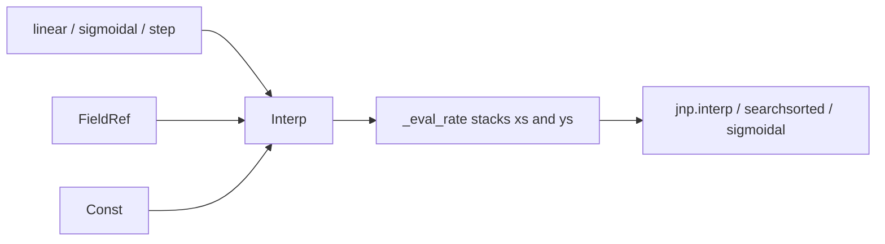

# Parametric interpolator breakpoints

## Context

Today [`Interp`](src/summer4/flows/rates.py) stores `breakpoints: tuple[float, ...]` (static) and `values: tuple[RateOps, ...]` (calibratable). WP5 deliberately froze x so digests stayed hashable and gathers stayed simple ([`plans/time-varying.plan.md`](plans/time-varying.plan.md) §5.3). summer2 already allowed Parameters on x (`x_points = [0.0, Parameter("inflection_time"), 10.0]`).

JAX constraint you stated: **breakpoint count is static** (tuple length / stack axis). Verified locally: `jax.grad` through a traced `jnp.interp` xp works.

**Depends on:** WP5 tip (current uncommitted stack on `fix/describe-params`, or the merged WP5 branch). Branch as `feat/parametric-interp-x` from that tip, not from `main`. Copy this plan to [`plans/parametric-interp-x.plan.md`](plans/parametric-interp-x.plan.md).

**Ledger:** no new rows. P6–P8 stay `full`; update Notes to say breakpoints may be `FieldRef`s. Coverage totals unchanged.

**Scope default:** all `Interp` kinds (`linear`, `sigmoidal`, `step`/`piecewise`) share one node — same change for all. `GaussianPulse` and `Data.interp` (observed dates) stay as they are.

## Design



Change [`Interp`](src/summer4/flows/rates.py) to:

```python
@dataclass(frozen=True, slots=True)
class Interp(RateOps):
    kind: Literal["linear", "sigmoidal", "step"]
    breakpoints: tuple[RateOps, ...]   # was tuple[float, ...]
    values: tuple[RateOps, ...]
    arg: RateOps
    sharpness: float = 1.0
```

Constructors in [`src/summer4/timevarying.py`](src/summer4/timevarying.py):

- Accept `Sequence[object]` for breakpoints (float or rate), coerce with `as_rate` like values.
- Keep length checks (`len(values) == len(breakpoints)` / `+ 1` for step).
- **Ordering contract:** if every breakpoint coerces to `Const`, keep the current strictly-increasing host check. If any is non-`Const`, skip the numeric check and document that the evaluated sequence must stay strictly increasing (no runtime sort — sorting would break gradients and hide crossed knots).

Eval in [`_eval_rate` / `_eval_interp`](src/summer4/flows/compiled.py):

- Stack evaluated breakpoints the same way values are stacked today.
- Pass the stacked array into `_eval_interp` (signature becomes array xp, not `tuple[float, ...]`).
- Existing `jnp.interp` / `searchsorted` / sigmoidal path unchanged numerically.

Five-site rule updates for `Interp`:

| Site | Change |
|---|---|
| `_eval_rate` | Stack breakpoints |
| `_flow_refs` / `_field_paths` | Recurse into **breakpoints as well as** values and arg (today values+arg only — a `FieldRef` breakpoint would otherwise be omitted from `computed_paths`) |
| `_rate_bytes` | Drop `np.asarray(breakpoints).tobytes()`; fold recursive `_rate_bytes` of each breakpoint (Const floats still land in the digest via `Const`) |
| `__all__` | Unchanged |

`Data.interp` continues to emit float/`Const` breakpoints from dated series — no API change.

## Tests — extend [`tests/test_time_varying.py`](tests/test_time_varying.py)

- Round-trip: `linear(Time(), (refs.t0, refs.t1), (0.0, 1.0))` evaluates correctly at midpoints for concrete params.
- **`jax.grad` w.r.t. a breakpoint `FieldRef`** matches central differences (mirror existing y-knot calibratability test).
- Mixed Const/`FieldRef` breakpoints; step with parametric x.
- Digest: two models differing only in a `FieldRef` breakpoint path (or a Const breakpoint value) have different `_digest`; equal structures hash equal.
- Host validation still rejects non-increasing all-Const breakpoints; mixed FieldRef skips that check.
- Existing static-float call sites keep passing (floats → `Const` via `as_rate`).

## Notebooks

Extend both (asserted, not display-only):

1. [`examples/notebooks/08-time-varying.ipynb`](examples/notebooks/08-time-varying.ipynb) — new section: calibratable intervention **start time** (parametric x, fixed y), plus both x and y as `FieldRef`s; assert `jax.grad` on the start-time param is finite / matches FD.
2. [`docs/summer2/time-varying-functions.ipynb`](docs/summer2/time-varying-functions.ipynb) — restore the summer2 “GraphObjects as x” example: `linear(Time(), (0.0, refs.inflection_time, 10.0), (0.0, refs.inflection_value, 0.0))`, evaluate under two param sets, Plotly via `to_pandas()` / `notebook_connected`.

## Verification

```bash
pixi run lint && pixi run format-check && pixi run check-notebooks
pixi run test && pixi run check-branch && pixi run coverage
pixi run -e docs docs-strict
```

Notebook gate: user runs `08-time-varying.ipynb` and the summer2 page in `pixi run notebook` before merge.
