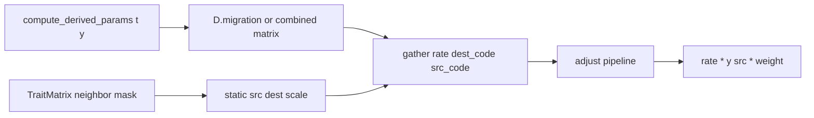

# Refine flows (derived bundles + adjustments)

## Intent and landing

Follow-up spike on the existing `[explore-flows](plans/explore-flows.plan.md)` / `[explore-flows-refs](plans/explore-flows-refs.plan.md)` work. Do not edit those archived plans.

- Branch `refine-flows` from current `explore-flows` (same deliberate exception to the `feat/` prefix).
- **No `src/summer4` changes.** Work stays in `[explorations/flows/](explorations/flows/)` and `[tests/test_explore_flows.py](tests/test_explore_flows.py)`.
- Copy this plan to `[plans/refine-flows.plan.md](plans/refine-flows.plan.md)`.
- Keep `[01-flows.ipynb](explorations/flows/01-flows.ipynb)` as the API tutorial (same section story). Only touch it if a prototype change forces an import or constructor update; prefer backward-compatible additions so it stays as-is.
- Add `[explorations/flows/02-flows.ipynb](explorations/flows/02-flows.ipynb)` for the new ideas, plus a FINDINGS section for this follow-up.

```
explorations/flows/
  prototype.py       + nested derived_refs, matrix-rate align, adjust pipeline, euler
  01-flows.ipynb     unchanged unless an API break is unavoidable
  02-flows.ipynb     time-varying migration + adjustments + jitted Euler
  FINDINGS.md        append refine-flows notes
tests/test_explore_flows.py   new unit tests + exec 02
```

## What is already true (do not reinvent)

The rate layer is already a small expression tree: `Const`, `FieldRef`, `FlowRef`, `BinOp` (`+ - * /`). `[derived_refs](explorations/flows/prototype.py)` builds schema-named `FieldRef`s. `[_align_rate](explorations/flows/prototype.py)` already accepts scalar / full-map / edge-length arrays. `FieldRef.__getattr__` already walks nested paths.

The gaps this spike fills:

- A **dest×source matrix** from derived params does not align onto `TraitMatrix` edges.
- `derived_refs` does not recurse, so a nested `Migration` bundle is not one IDE-completable proxy.
- There is no sequential **adjustment pipeline** whose next step sees the previous numeric flow values (summer2 `Multiply` / `Overwrite` in `[summer2/code/summer2/adjust.py](/Users/s/dev/EMU/summer2/code/summer2/adjust.py)`). The first plan explicitly left that out (“stratum-specific rates are PropertyData instead”).

## 1. Nested derived refs — one proxy for a bundle

Extend `[derived_refs](explorations/flows/prototype.py)` so a field whose annotation is itself a `NamedTuple` class becomes a nested instance of that schema, filled with `FieldRef`s whose paths are prefixed:

```python
class Migration(NamedTuple):
    baseline: object   # dest × source ndarray at runtime
    seasonal: float

class Derived(NamedTuple):
    foi: float
    death_rate: float
    migration: Migration

D = derived_refs(Derived)
# D.migration is Migration(baseline=FieldRef(("migration","baseline")), ...)
# D.migration.seasonal is FieldRef(("migration", "seasonal"))
```

Flat schemas (`01-flows`) stay unchanged. Unknown attributes still raise. Recursion is one level or N; implement N, tests use one.

Two ways to pass “all this” as **one argument** — both appear in `02`:

- **Combined field.** `compute_derived_params` already does `baseline * seasonal(t)` and returns that ndarray on `Derived.migration_rates`. The flow rate is `D.migration_rates`.
- **Nested proxy.** The flow rate is `D.migration.baseline * D.migration.seasonal` (existing `BinOp`). Same compactness as `D.foi`.

Do **not** auto-multiply a looked-up NamedTuple (too magical). The “single proxy” is the nested `D.migration` object you pass into ordinary arithmetic (or the already-combined field). Record in FINDINGS whether a later `__rate__` protocol is worth it.

## 2. Time-varying matrix rates on a static topology

`TraitMatrix` stays the **sparsity / pairing** object, actualized once. Changing which location pairs exist would rebuild index arrays and break `jit`. Dynamic values come from the flow `rate`.

Extend alignment: if the resolved rate is 2-D with shape `(n_traits, n_traits)` and the flow’s pairing is a `TraitMatrix` on that property, gather `rate[dest_code, src_code]` per edge. Store those codes on `[ActualizedFlow](explorations/flows/prototype.py)` at actualize time (from `pmap.codes` on `src_idx` / `dest_idx`).




`01` keeps `rate=1.0` + matrix entries in `scale` and does not need this path.

`02` uses a 0/1 neighbor mask in `TraitMatrix` and puts the time-varying dest×source array in `rate=D.migration_rates` (or `D.migration.baseline * D.migration.seasonal`). `compute_derived_params(..., t=t)` supplies e.g. `baseline * (1 + amp * sin(omega * t))`. Assert at two times that edge masses scale by that factor and `sum(dy)` from migration alone is 0.

If both `scale` (mask of 1s) and a matrix rate are present, they multiply — same as today’s `rate * scale`.

## 3. Flow adjustments — sequential, default Multiply

Adjustments are **not** another way to write `D.foi * 0.5`. They are a **pipeline on the already-aligned per-edge rate** (summer2: adjust the parameter, then apply the flow law). Each step’s input is the previous step’s output. Extra arguments are the same `RateOps` language (`FieldRef`, `FlowRef`, `BinOp`).

```python
TransitionFlow(
    "infection",
    state["S"],
    state["I"],
    D.foi,
    adjust=[
        D.seasonal,                              # bare value → Multiply
        Overwrite(0.0, where=age["0-4"]),
        Transform(np.minimum, D.foi_cap),        # fn(prev, *args)
        Transform(lambda prev, d: prev * d, death.sum()),
    ],
)
```

Rules:

- `adjust=` on `TransitionFlow` / `ExitFlow` / `EntryFlow`, default `()`.
- A bare scalar / `RateOps` in the list is `**Multiply**` (summer2 `enforce_multiply`).
- `**Multiply(value, where=None)**` — `prev * value`.
- `**Overwrite(value, where=None)**` — replace `prev` with `value`.
- `**Transform(fn, *args, where=None)**` — `fn(prev, *resolved_args)`. `fn` must be vectorized over edges (NumPy ufunc or `jax.numpy` ufunc). No closed op enum; arbitrary callables are the point of the spike.
- Optional `where: Selector` masks the gather index (`src` for transition/exit, `dest` for entry). Unmatched edges keep `prev`.
- Pipeline runs **after** rate align + pairing `scale`, **before** `* y[src]` (parameter adjustment, not mass clipping). Note mass-level limiting (`min(mass, y)`) as a FINDINGS open question.
- `[_flow_refs](explorations/flows/prototype.py)` walks `adjust` so `Transform(..., death.sum())` participates in topo order. Cycles still raise.

This stays compact: same constructor style as `split=` / `pairing=`, same refs as rates. `*` on the rate expression remains the way to bake a multiply into the definition; `adjust=` is the ordered, prev-valued, optionally stratum-scoped layer.

Do **not** add mutating `FlowRef.adjust(...)` — `FlowRef` stays a frozen expression node.

## 4. Minimal Euler stepper (end-to-end, JIT-wrapped)

The first spike stopped at `vf(t, y, params)` and left integrate out of scope. This follow-up adds a **tiny forward Euler** so time-varying derived matrices, `adjust=`, and `FlowRef`s are proven across several steps — including inside `jax.jit`. Not Diffrax, not adaptive, not a results type.

```python
def euler(
    vf: Callable[..., Any],
    t0: Any,
    y0: Any,
    params: Any,
    *,
    dt: float,
    steps: int,
) -> Any:
    """y <- y + dt * vf(t, y, params), repeated ``steps`` times. Returns final y."""
```

Two backends, same contract:

- **NumPy:** a Python `for` over `steps` (unit tests, `01` remains vf-only).
- **JAX:** `jax.lax.scan` over `steps` so the **stepper itself** is the jit target, not an unrolled Python loop:

```python
vf = model.compile(derived_fn=compute_derived_params, backend="jax")
step = jax.jit(lambda y: euler(vf, 0.0, y, params, dt=0.25, steps=8))
y_t = step(jnp.asarray(y0))
```

`steps` and `dt` are compile-time constants for that wrapper (close over them; do not take `steps` as a traced argument). `params` is a pytree. `y` may be a raw array or `PropertyData`; the scan carries the same type `vf` returns.

`02` is the end-to-end proof: compile the sequel model (time-varying migration + at least one `adjust=`), run NumPy Euler and jitted scan Euler for the same `dt` / `steps`, assert they match, assert a conservation property where the model implies one (migration-only `sum(y)` constant; replacement death+birth `sum(y)` constant), and assert the trajectory **differs** from a constant-rate control so `t` actually entered `compute_derived_params`. A few steps (8–16) is enough; no timeseries object, no interpolant, no solver options.

`Transform` callables used on the jitted path must be JAX-traceable (`jnp.minimum`, not a Python `if` over edges). That is part of the end-to-end check.

## 5. Notebooks

`**01-flows.ipynb`:** same eight sections (map → model → infection → recovery → ageing → migration → death/birth → derived vf → JAX). Update only if an export or constructor signature forces it.

`**02-flows.ipynb`:** same map (SIR × age × 3×3 location) so it reads as a sequel, then:

1. Nested `Derived` / `Migration` and `derived_refs` (assert paths).
2. Time-varying migration via one combined `FieldRef` matrix; mask topology; assert two-time scaling and mass balance.
3. Same story written as `D.migration.baseline * D.migration.seasonal`.
4. Adjustments on infection: seasonal `Multiply`, age `Overwrite`, `Transform` clip to a derived cap, `Transform` that consumes `death.sum()` (or another `FlowRef`). Assert numeric `dy` slices.
5. Short note in-notebook: `*` vs `adjust=[Multiply]` — when each is clearer.
6. Euler: NumPy multi-step, then `jax.jit` around the scan stepper; match the two finals; show time-varying migration moves mass differently than a frozen matrix.

No IPython magics. Assert outcomes. Leave outputs cleared.

## 6. Tests and FINDINGS

Extend `[tests/test_explore_flows.py](tests/test_explore_flows.py)` (or add `test_refine_flows.py` imported by the same pixi task):

- Recursive `derived_refs` paths; non-NamedTuple field types stay leaves.
- Matrix rate gather: 2-location `TraitMatrix` mask + dest×source `FieldRef`; values at `t` match.
- `adjust` Multiply default; Overwrite with `where=`; Transform `minimum`; Transform depending on a `FlowRef` (topo).
- Euler: NumPy vs `jax.jit(scan)` agree; time-varying derived rate changes the final `y` vs a constant control.
- Existing `01` exec test plus the same for `02`.

Append to `[FINDINGS.md](explorations/flows/FINDINGS.md)`: nested refs, static topology + dynamic matrix, `adjust=` pipeline vs rate `*`, callable `Transform` vs jit (the jitted Euler is the proof), `lax.scan` stepper, no auto-unpack of bundles, mass-level limit left open. Still no promotion into `src/summer4`.

## Out of scope

- Time-varying `split=` or changing matrix sparsity after compile
- Mutating `FlowRef` / summer2 `flow.adjustments.append`
- A `CategoryData` type
- Diffrax, adaptive stepping, save-at / timeseries results
- Promoting anything into `src/summer4` or `examples/notebooks/`

