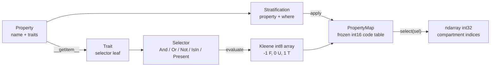

## Scope

Stage 1 is the compartment taxonomy only. No flows, adjustments, rates, or solvers. The deliverable is: given Properties and Stratifications, produce a stable compartment ordering and answer arbitrary queries as integer index arrays, fast.

Deliberate constraint: **the taxonomy layer imports NumPy and nothing else.** JAX is a workspace dependency (for the environment matrix and later stages) but never imported by these modules. That keeps this layer trivially testable and makes the static/traced boundary obvious.

## Repository layout

```
s3a/
  pixi.toml            pixi workspace + JAX version feature matrix
  pyproject.toml       hatchling, src layout -> `pip install summer4`
  src/summer4/
    __init__.py        public re-exports
    properties.py      Property, Trait
    selectors.py       Selector algebra, Kleene evaluation
    propertymap.py     PropertyMap, Stratification
  tests/
    test_properties.py
    test_selectors.py
    test_propertymap.py
    test_taxonomy_properties.py   hypothesis property tests
  benchmarks/test_bench_taxonomy.py
  README.md
```

## Core concepts (four types, one algebra)



### `properties.py`

```python
@dataclass(frozen=True, slots=True)
class Trait:
    """A single mutually-exclusive value of a Property; also a Selector leaf."""
    property: str
    name: str
    code: int

@dataclass(frozen=True, slots=True)
class Property:
    name: str
    traits: tuple[str, ...]          # validated: non-empty, unique
    def __getitem__(self, key: str | Sequence[str]) -> Selector: ...
    def isin(self, names: Iterable[str]) -> Selector: ...
    def present(self) -> Selector: ...
    def absent(self) -> Selector: ...
    def trait(self, name: str) -> Trait: ...
```

Properties are identified **by name**, not object identity (this is the fragility in `summer3wip/summer3/proto.py:25` where `Stratification` instances are dict keys). Names must be unique within a `PropertyMap`. `Trait` stores `property: str`, so selectors are serialisable and never hold live references.

### `selectors.py` — Kleene three-valued algebra

Every selector evaluates to an `int8` array over compartments encoding `-1 = false, 0 = unknown (property not applicable), 1 = true`. That encoding makes the whole algebra three NumPy primitives:

```python
def _not(a): return -a
def _and(a, b): return np.minimum(a, b)
def _or(a, b): return np.maximum(a, b)
```

Nodes, all frozen/slots/hashable:
- leaves: `Trait`, `IsIn(property, traits)`, `Present(property)`, `Absent(property)`, `Everything()`, `Nothing()`
- combinators: `And`, `Or`, `Not` via `&`, `|`, `~`

`select()` returns only compartments evaluating to `1`, so with a ragged `severity` property both `severity["mild"]` and `~severity["mild"]` exclude compartments that have no severity — you reach those with `severity.absent()`. `Present`/`Absent` are the only definite (two-valued) leaves.

### `propertymap.py`

```python
@dataclass(frozen=True, slots=True)
class PropertyMap:
    properties: tuple[Property, ...]         # in application order
    codes: NDArray[np.int16]                 # (n_compartments, n_properties); -1 = N/A
    history: tuple[Stratification, ...]
    parent_row: NDArray[np.int32] | None     # provenance into the pre-stratify map
```

Immutable: `stratify` returns a new map. Key methods, all fully typed:

- `from_property(p) -> PropertyMap` — the only bootstrap; `n = len(p.traits)`
- `stratify(property, where: Selector | None = None) -> PropertyMap`
- `mask(sel) -> NDArray[np.bool_]` / `select(sel) -> NDArray[np.int32]` / `select_one(sel) -> int`
- `partition(property) -> dict[Trait, NDArray[np.int32]]` — the "query groups feed other operations" primitive
- `group_by(*properties) -> Iterator[tuple[tuple[Trait, ...], NDArray[np.int32]]]`
- `labels() -> tuple[str, ...]`, `to_dicts()`, `__repr__` table view

**Stratify algorithm** (pure NumPy, no per-compartment Python loop): compute `keep = mask(where) != 1`, build a `reps` array (`1` for keep rows, `k` for matched rows), `row_src = np.repeat(np.arange(n), reps)`, gather `codes[row_src]`, append a new column filled `-1` then tiled `0..k-1` at matched positions. Matched compartments expand **in place** so a stratification's strata stay contiguous, which makes most queries collapse to slices.

Validation is eager: unknown property name, unknown trait, duplicate property name, or restratifying a compartment that already carries that property all raise at build time.

**Query caching**: selectors are hashable and `PropertyMap` is frozen, so `select`/`mask` memoise on `hash(selector)` in a private dict. This removes the repeated O(n) rescans that `summer3wip` does in `get_cat_indices` (`summer3/categories.py:172`).

### `Stratification` as a value

The user framing is "Stratification = the application of a Property to a PropertyMap", so it is a record, not just a method:

```python
@dataclass(frozen=True, slots=True)
class Stratification:
    property: Property
    where: Selector | None = None
    def apply(self, pmap: PropertyMap) -> PropertyMap: ...
```

`PropertyMap.stratify(...)` is sugar that constructs and applies one. Applied stratifications accumulate in `history`, giving replayable provenance for later stages (population splitting, ageing flows) without a separate action tracker like `summer2/code/summer2/population.py:115`.

### Target usage

```python
from summer4 import Property, PropertyMap

state = Property("state", ("S", "I", "R"))
age   = Property("age", ("0-4", "5-9", "10+"))
sev   = Property("severity", ("mild", "severe"))

pm = (PropertyMap.from_property(state)
        .stratify(age)
        .stratify(sev, where=state["I"]))

pm.select(state["I"] & age["0-4"])          # -> int32 indices
pm.select(age[("0-4", "5-9")] & ~sev["severe"])
pm.select(sev.absent())
pm.partition(age)                            # {Trait(age,0-4): idx, ...}
```

## Environment and packaging

`pixi.toml` workspace at the repo root, `platforms = ["osx-arm64", "linux-64"]`, with the package installed editable (`summer4 = { path = ".", editable = true }`). Feature-based JAX matrix, following what already resolves in `/Users/s/dev/EMU/summer4/A/pixi.toml`:

- `jax06` — Python 3.13, `jax`/`jaxlib` `>=0.6,<0.7`, `diffrax >=0.7.2,<0.8`, `numpyro >=0.16,<0.17`, `optax`. **This is the default environment.**
- `jaxlatest` — Python 3.13, current `jax`, `diffrax`, `numpyro`, `optax`
- `dev` — pytest, pytest-benchmark, hypothesis, ruff, mypy
- `notebooks` — ipykernel, jupyterlab, matplotlib

Environments: `default = ["jax06","dev"]`, `latest = ["jaxlatest","dev"]`, `nb = ["jax06","notebooks","dev"]`.

Tooling: hatchling build backend (so `pip install .` and wheel publishing work independently of pixi), `ruff` for both lint and format (replaces the black+flake8 pair in `summer4/A`), `mypy --strict` over `src/summer4`.

Tasks: `test`, `test-all` (runs the suite in each JAX env), `lint`, `format`, `bench`, `bench-json` (writes per-env benchmark JSON keyed by JAX version so environments are directly comparable).

`uv` is not installed on this machine and pixi already handles the editable install plus lockfile; hatchling alone covers pip-installability, so no extra tool is added.

## Testing

- Truth-table tests for the Kleene algebra including all `U` cases.
- Stratify: full application, partial via `where`, compartment counts, contiguity of new strata, rejection of double-stratification.
- Three-valued query semantics on a ragged map: `sev["mild"]`, `~sev["mild"]`, and `sev.absent()` partition the compartment set exactly.
- Hypothesis property tests over random stratification sequences: no duplicate compartments, `select(a & b) == intersect(select(a), select(b))`, `partition` is a disjoint cover of `present()`, ordering is deterministic across rebuilds.
- `benchmarks/test_bench_taxonomy.py`: build time and query time at ~10, ~1k, ~100k compartments; cold vs cached select.

## Explicitly out of scope for stage 1

Flows, source/dest joining, adjustments, rates, compile step, solvers, results/xarray. The join rule (pair source and dest on stratifications left free by both queries) is the natural next stage and `select`/`partition` are its only required inputs.